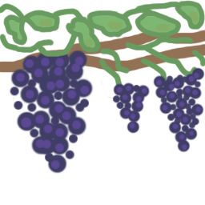

# vineyard

*A language that compiles to masm.*

Presently not in development because I can't be bothered to finish it.

## info

This language has very very limited scope. It is designed to do one thing only:
make my time in assembly class less painful.

## goals

- abstraction over memory and registers
- abstraction over external function calls and mnemonics
